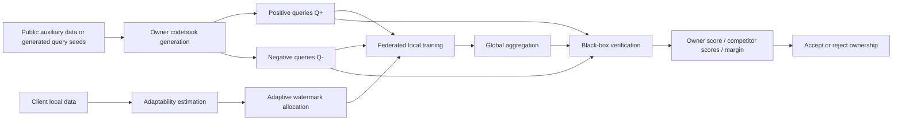

# BBV: Non-IID-Aware Low-Ambiguity Adaptive Black-Box Verification

[English](README.md) | [简体中文](README.zh-CN.md)

A research codebase for model ownership verification in federated learning, targeting the problem defined in `deep-research-report-2.md`: designing a copyright verification method that simultaneously addresses `non-IID adaptability`, `low ambiguity`, `black-box verifiability`, and `lightweight provenance` under non-IID federated training scenarios.

This project focuses on the following research threads:

- Adaptive watermark allocation for non-IID federated training
- Multi-bit codebook-based black-box copyright verification
- Low-ambiguity ownership judgment using positive and negative evidence
- Margin-style competitor comparison addressing false-claim risks
- Support for real attacks, statistical calibration, privacy leakage evaluation, and report export

## Table of Contents

- [1. Research Overview](#1-research-overview)
- [2. Method Sketch](#2-method-sketch)
- [3. Repository Scope](#3-repository-scope)
- [4. Project Structure](#4-project-structure)
- [5. Environment Setup](#5-environment-setup)
- [6. Data Preparation](#6-data-preparation)
- [7. Quick Start](#7-quick-start)
- [8. Full Experiment Workflow](#8-full-experiment-workflow)
- [9. Output Artifacts](#9-output-artifacts)
- [10. Metrics and Research Questions](#10-metrics-and-research-questions)
- [11. Testing](#11-testing)
- [12. Practical Notes](#12-practical-notes)

## 1. Research Overview

### 1.1 Problem Setting

This project addresses the following research question:

> In federated learning, how to build a method that can adapt to non-IID data heterogeneity, reduce false positives and ownership ambiguity, and enable remote copyright verification under black-box query conditions?

Unlike traditional black-box watermarking that focuses only on single trigger hit rates, we emphasize:

- Not just "can it be verified successfully," but "can it be verified with low ambiguity"
- Not just "effective for owner models," but "should not misclassify non-owner models"
- Not just "still triggerable after attacks," but "maintains statistically interpretable owner score / margin / AUC after attacks"

### 1.2 Research Goals

This repository is organized around five research goals proposed in `deep-research-report-2.md`:

- **H1**: Adaptive watermark allocation outperforms uniform allocation
- **H2**: Multi-bit codebook + negative evidence + margin decision reduces FPR and ambiguity
- **H3**: Stable black-box verification under hard-label or low-dimensional output APIs
- **H4**: Robustness against fine-tuning, pruning, quantization, distillation, and extraction attacks
- **H5**: Control system overhead without significantly increasing privacy leakage risks

### 1.3 Recommended Research Route

According to the research plan, the most suitable route for the first round of experiments is:

- Visual main datasets: `CIFAR-10`, `CIFAR-100`, `FEMNIST`
- Text supplement: `Sent140`
- Priority: main experiments, ablation, false-claim, robustness, privacy evaluation
- Not pursued initially: heavy cryptographic protocols, blockchain provenance, diffusion models, multimodal FL

## 2. Method Sketch

The method prototype corresponding to this repository can be summarized as `NILA-BBV`:

`Non-IID Low-Ambiguity Adaptive Black-Box Verification`

### 2.1 Core Modules

The method consists of five core modules:

1. **Codebook-Based Queries**
   Generate multi-bit codebooks for owners and construct black-box query sets accordingly, rather than relying on a single trigger.

2. **Negative Evidence**
   Construct negative evidence sets in addition to positive queries to suppress false triggers and false claims.

3. **Adaptive Allocation**
   Adaptively allocate watermark budget based on client statistical features and watermark adaptability, rather than uniform allocation.

4. **Margin-Based Black-Box Decision**
   During verification, compute not only the owner score but also compare competitor owner scores, reporting margin and ambiguity.

5. **Lightweight Commitment**
   Store owner identifier, seed, codebook hash, timestamp, and training configuration summary as lightweight provenance records.

### 2.2 Pipeline Overview



## 3. Repository Scope

### 3.1 What Is Implemented

The current repository covers the following experimental capabilities:

- **Dataset Loading**
  - `cifar10`
  - `cifar100`
  - `femnist` (real LEAF-style natural split)
  - `sent140` (real LEAF-style natural split)
  - `shakespeare` configuration entry reserved, but `sent140` is recommended for current focus experiments

- **Federated Training**
  - Dataset-backed client subsets
  - Controlled non-IID partitions: `dirichlet`, `shard`, `quantity_skew`, `combined_label_quantity`
  - Natural partitions for LEAF-style datasets

- **Watermark / Verification**
  - Multi-bit codebooks
  - Positive/negative evidence queries
  - Owner score
  - Competitor scores
  - Margin decision
  - Ambiguity flag
  - Threshold calibration

- **Attacks**
  - `finetune`
  - `pruning`
  - `quantization`
  - `distillation`
  - `extraction`

- **Evaluation / Reporting**
  - False-claim acceptance rate
  - Ambiguity/FPR/FNR summaries
  - Privacy leakage AUC
  - Robustness summaries
  - Tables, figures, summary markdown export

### 3.2 What Is Not the Focus

The current repository does not prioritize the following directions:

- Heavy cryptographic attestation protocols
- Blockchain or decentralized provenance systems
- Diffusion models and multimodal federated copyright protection
- Large-scale production system deployment

If your goal is first-paper reproduction and extension, it is recommended to complete the experimental loop within the current research scope first.

## 4. Project Structure

```text
bbv/
├── configs/                 # Hydra configs for train/eval/attacks/report
├── data/
│   ├── raw/                 # Raw or processed datasets
│   ├── splits/              # Saved partition metadata
│   └── cache/               # Temporary caches
├── docs/
│   └── superpowers/         # Plans and design docs
├── outputs/
│   ├── runs/                # Training runs
│   ├── attacks/             # Attack runs
│   ├── figures/             # Exported figures
│   ├── tables/              # Exported CSV tables
│   └── summaries/           # Markdown summaries
├── scripts/
│   ├── data/                # Dataset preparation scripts
│   ├── train/               # Training entrypoints
│   ├── eval/                # Verification entrypoints
│   ├── attacks/             # Attack entrypoints
│   └── report/              # Report export entrypoints
├── src/bbv/
│   ├── allocation/
│   ├── attacks/
│   ├── datasets/
│   ├── evaluation/
│   ├── federated/
│   ├── models/
│   ├── privacy/
│   ├── reporting/
│   ├── verification/
│   └── watermarking/
└── tests/
    ├── unit/
    ├── integration/
    └── smoke/
```

## 5. Environment Setup

### 5.1 Python Version

Recommended:

- `Python 3.11`

### 5.2 Create a Conda Environment

Example using `conda`:

```bash
conda create -n bbv python=3.11 -y
conda activate bbv
```

### 5.3 Install Dependencies

This repository uses `uv` to manage project dependencies. After entering the repository root directory, execute:

```bash
uv sync --extra dev
```

PyTorch is intentionally not pinned in `pyproject.toml`. Install it separately so you can choose the correct runtime for your machine.

For CUDA 12.8, install the official `cu128` wheels:

```bash
uv pip install --index-url https://download.pytorch.org/whl/cu128 torch torchvision
```

For CPU-only environments:

```bash
uv pip install --index-url https://download.pytorch.org/whl/cpu torch torchvision
```

If your machine does not have `uv` installed, you can install it first:

```bash
pip install uv
```

### 5.4 Optional GPU Check

If you want to verify that PyTorch correctly recognizes CUDA:

```bash
python -c "import torch; print(torch.cuda.is_available())"
```

If `import torch` fails with missing `libcudnn.so` or other CUDA runtime libraries, your PyTorch runtime does not match the server driver/runtime setup. Reinstall the correct wheel variant first.

## 6. Data Preparation

### 6.1 CIFAR Datasets

`CIFAR-10` and `CIFAR-100` can be automatically downloaded during training.

Default download directory:

- `data/raw/`

### 6.2 Prepare LEAF Datasets

To conduct real natural non-IID experiments, prepare LEAF-style data first.

#### Prepare FEMNIST

```bash
uv run python scripts/data/prepare_leaf_datasets.py --dataset=femnist
```

#### Prepare Sent140

```bash
uv run python scripts/data/prepare_leaf_datasets.py --dataset=sent140
```

#### Prepare Both

```bash
uv run python scripts/data/prepare_leaf_datasets.py --dataset=all
```

Default output layout:

```text
data/raw/femnist/train/*.json
data/raw/femnist/test/*.json
data/raw/sent140/train/*.json
data/raw/sent140/test/*.json
```

### 6.3 Dataset Notes

- **FEMNIST**
  - Real writer-level natural split
  - Suitable for validating natural non-IID image federated training

- **Sent140**
  - Real user-level natural split
  - Suitable for supplementing text task results

- **CIFAR-10 / CIFAR-100**
  - Suitable for controlled non-IID partitioning, e.g., Dirichlet, shard, quantity skew

## 7. Quick Start

This section is used to confirm that code, data, and command chains are working properly.

### 7.1 Run Smoke Tests

```bash
uv run pytest tests/smoke -q
```

### 7.2 Run Full Test Suite

```bash
uv run pytest tests/unit tests/integration tests/smoke -q
```

### 7.3 Train One Watermarked Model

Example with `CIFAR-10`:

```bash
uv run python scripts/train/run_watermark_baseline.py \
  dataset=cifar10 \
  allocation=adaptive \
  owner.id=owner0 \
  seed=0
```

Example with `FEMNIST`:

```bash
uv run python scripts/train/run_watermark_baseline.py \
  dataset=femnist \
  allocation=adaptive \
  owner.id=owner0 \
  seed=0
```

Example with `Sent140`:

```bash
uv run python scripts/train/run_watermark_baseline.py \
  dataset=sent140 \
  allocation=adaptive \
  owner.id=owner0 \
  seed=0
```

### 7.4 Run Verification

```bash
uv run python scripts/eval/run_verification.py \
  dataset=cifar10 \
  verification=margin \
  owner.id=owner0 \
  seed=0
```

### 7.5 Run One Attack

```bash
uv run python scripts/attacks/run_attack_suite.py \
  attack=finetune \
  dataset=cifar10 \
  seed=0
```

You can also change `attack` to:

- `pruning`
- `quantization`
- `distillation`
- `extraction`

### 7.6 Export One Report Bundle

```bash
uv run python scripts/report/build_report.py \
  dataset=cifar10 \
  study=main \
  outputs_dir=outputs/runs \
  attacks_dir=outputs/attacks
```

## 8. Full Experiment Workflow

This section provides a complete experimental workflow closer to paper reproduction.

### 8.1 Recommended Execution Order

It is recommended to proceed in the following order:

1. Environment and test validation
2. Data preparation
3. Main training experiments
4. Black-box verification
5. Attack robustness experiments
6. False-claim and ablation experiments
7. Summary table and figure export

### 8.2 Main 3-Seed Runs

The research plan recommends running at least 3 random seeds. Current default main matrix configuration:

- `seeds: [0, 1, 2]`
- report studies: `main`, `ablation`, `false_claim`, `robustness`

You can run manually in sequence:

```bash
uv run python scripts/train/run_watermark_baseline.py dataset=cifar10 allocation=adaptive owner.id=owner0 seed=0
uv run python scripts/train/run_watermark_baseline.py dataset=cifar10 allocation=adaptive owner.id=owner0 seed=1
uv run python scripts/train/run_watermark_baseline.py dataset=cifar10 allocation=adaptive owner.id=owner0 seed=2
```

If you are studying `FEMNIST`:

```bash
uv run python scripts/train/run_watermark_baseline.py dataset=femnist allocation=adaptive owner.id=owner0 seed=0
uv run python scripts/train/run_watermark_baseline.py dataset=femnist allocation=adaptive owner.id=owner0 seed=1
uv run python scripts/train/run_watermark_baseline.py dataset=femnist allocation=adaptive owner.id=owner0 seed=2
```

If you are studying `Sent140`:

```bash
uv run python scripts/train/run_watermark_baseline.py dataset=sent140 allocation=adaptive owner.id=owner0 seed=0
uv run python scripts/train/run_watermark_baseline.py dataset=sent140 allocation=adaptive owner.id=owner0 seed=1
uv run python scripts/train/run_watermark_baseline.py dataset=sent140 allocation=adaptive owner.id=owner0 seed=2
```

### 8.3 Non-IID Partition Studies on CIFAR

For `CIFAR-10 / CIFAR-100`, you can adjust partition parameters in the configuration, such as:

- `partition_type=dirichlet`
- `partition_type=shard`
- `partition_type=quantity_skew`
- `partition_type=combined_label_quantity`

Example:

```bash
uv run python scripts/train/run_watermark_baseline.py \
  dataset=cifar10 \
  dataset.partition_type=dirichlet \
  dataset.concentration=0.3 \
  allocation=adaptive \
  owner.id=owner0 \
  seed=0
```

Quantity skew example:

```bash
uv run python scripts/train/run_watermark_baseline.py \
  dataset=cifar10 \
  dataset.partition_type=quantity_skew \
  dataset.quantity_sigma=1.0 \
  allocation=adaptive \
  owner.id=owner0 \
  seed=0
```

Combined skew example:

```bash
uv run python scripts/train/run_watermark_baseline.py \
  dataset=cifar100 \
  dataset.partition_type=combined_label_quantity \
  dataset.concentration=0.3 \
  dataset.quantity_sigma=1.0 \
  allocation=adaptive \
  owner.id=owner0 \
  seed=0
```

### 8.4 Verification Studies

The verification stage recommends at least focusing on the following variables:

- `decision_threshold`
- `margin`
- `competitor_owner_ids`
- `hard_label_only`
- `query_budget`

Hard-label-only verification example:

```bash
uv run python scripts/eval/run_verification.py \
  dataset=cifar10 \
  owner.id=owner0 \
  verification=margin \
  verification.hard_label_only=true \
  verification.query_budget=32 \
  seed=0
```

Example with competitor owners:

```bash
uv run python scripts/eval/run_verification.py \
  dataset=cifar10 \
  owner.id=owner0 \
  verification=margin \
  verification.competitor_owner_ids=[owner1,owner2] \
  seed=0
```

### 8.5 Robustness Studies

Run the 5 types of attacks separately:

```bash
uv run python scripts/attacks/run_attack_suite.py attack=finetune dataset=cifar10 seed=0
uv run python scripts/attacks/run_attack_suite.py attack=pruning dataset=cifar10 seed=0
uv run python scripts/attacks/run_attack_suite.py attack=quantization dataset=cifar10 seed=0
uv run python scripts/attacks/run_attack_suite.py attack=distillation dataset=cifar10 seed=0
uv run python scripts/attacks/run_attack_suite.py attack=extraction dataset=cifar10 seed=0
```

After completion, export the robustness report:

```bash
uv run python scripts/report/build_report.py \
  dataset=cifar10 \
  study=robustness \
  outputs_dir=outputs/runs \
  attacks_dir=outputs/attacks
```

### 8.6 False-Claim and Ablation Studies

The research plan specifically emphasizes false-claim risks, so it is recommended to retain:

- owner claim
- false claim
- competitor owner score comparison
- ambiguity / margin distribution

Recommended studies to export:

```bash
uv run python scripts/report/build_report.py dataset=cifar10 study=main outputs_dir=outputs/runs attacks_dir=outputs/attacks
uv run python scripts/report/build_report.py dataset=cifar10 study=ablation outputs_dir=outputs/runs attacks_dir=outputs/attacks
uv run python scripts/report/build_report.py dataset=cifar10 study=false_claim outputs_dir=outputs/runs attacks_dir=outputs/attacks
uv run python scripts/report/build_report.py dataset=cifar10 study=robustness outputs_dir=outputs/runs attacks_dir=outputs/attacks
```

### 8.7 Recommended Minimal Paper-Grade Matrix

If your goal is to complete a submission-ready experimental matrix first, the minimum recommended includes:

- Main datasets: `CIFAR-10`, `FEMNIST`
- Extension datasets: `CIFAR-100` or `Sent140`
- At least `3 seeds` per group
- Main experiments + false-claim + robustness + privacy

A realistically executable minimal matrix is:

- `CIFAR-10`: main + robustness + ablation
- `FEMNIST`: main + robustness
- `Sent140`: main

## 9. Output Artifacts

### 9.1 Training Runs

Training outputs are located at:

- `outputs/runs/<run-id>/`

Typical files include:

- `metrics.json`
- `run_metadata.json`
- `checkpoint.pt`
- `best_checkpoint.pt`
- `owner_artifacts.json`
- `owner_commitment.json`
- `allocation_assignments.json`
- `verification_summary.json`
- `verification_margin_summary.json`
- `calibration_artifacts.json`

### 9.2 Attack Runs

Attack outputs are located at:

- `outputs/attacks/<attack-run-id>/`

Typical files include:

- `attacked_checkpoint.pt`
- `attack_log.json`
- `verification_after_attack.json`

### 9.3 Report Bundle

After exporting reports, the following will be generated:

- `outputs/tables/`
- `outputs/figures/`
- `outputs/summaries/`

Common files:

- `*-main-results.csv`
- `*-ablation-results.csv`
- `*-robustness-results.csv`
- `attack-robustness.csv`
- `*-main-figure.svg`
- `*-tradeoff-figure.svg`
- `owner-nonowner-score-distribution.svg`
- `*-summary.md`

## 10. Metrics and Research Questions

This project recommends at least focusing on the following metrics.

### 10.1 Verification Metrics

- `owner_score`
- `competitor_scores`
- `margin_value`
- `decision`
- `ambiguity_flag`
- `threshold`
- `AUC`

### 10.2 Statistical Metrics

- `acceptance_rate`
- `ambiguity_rate`
- `FPR`
- `FNR`
- `false_claim_acceptance_rate`
- `robustness_acceptance_rate`
- 95% confidence interval

### 10.3 Privacy Metric

- `privacy_leakage_auc`

### 10.4 How They Map to H1-H5

- **H1**
  - Check whether adaptive allocation improves acceptance rate or reduces FNR

- **H2**
  - Check ambiguity rate, FPR, false_claim_acceptance_rate

- **H3**
  - Check acceptance stability under hard-label-only conditions

- **H4**
  - Check robustness_acceptance_rate and post-attack owner score

- **H5**
  - Check privacy_leakage_auc and training cost/experiment overhead

## 11. Testing

### 11.1 Smoke Tests

```bash
uv run pytest tests/smoke -q
```

### 11.2 Unit Tests

```bash
uv run pytest tests/unit -q
```

### 11.3 Integration Tests

```bash
uv run pytest tests/integration -q
```

### 11.4 Full Suite

```bash
uv run pytest tests/unit tests/integration tests/smoke -q
```

## 12. Practical Notes

### 12.1 Current Hardware Assumption

According to the research plan, the default hardware budget for the first round of experiments is approximately:

- `1-2` consumer-grade GPUs with `24GB` VRAM

If you only have CPU, you can still complete smoke tests, unit/integration tests, and small-scale functional verification, but formal main experiments will be significantly slower.

### 12.2 Reproducibility Suggestions

It is recommended to fix the following in formal experiments:

- `seed`
- `dataset.partition_type`
- `dataset.concentration`
- `dataset.quantity_sigma`
- `owner.id`
- `verification.margin`
- `verification.decision_threshold`

Also retain:

- `run_metadata.json`
- `owner_commitment.json`
- `attack_log.json`
- `calibration_artifacts.json`

### 12.3 Common Issues

#### LEAF dataset not found

If the error indicates that `data/raw/femnist/...` or `data/raw/sent140/...` cannot be found, run first:

```bash
uv run python scripts/data/prepare_leaf_datasets.py --dataset=all
```

#### No verification summary generated

First confirm that the training run directory contains:

- `owner_artifacts.json`
- `best_checkpoint.pt` or `checkpoint.pt`

Then run the verification command.

#### Attack run exists but no post-attack verification

Please confirm that the post-attack verification process is also triggered after the attack command runs, or check before re-running report export:

- `outputs/attacks/<attack-run-id>/verification_after_attack.json`

### 12.4 Suggested First Reproduction Path

If you are using this repository for the first time, it is recommended to follow this order:

1. `conda create -n bbv python=3.11 -y`
2. `conda activate bbv`
3. `pip install uv`
4. `uv sync --extra dev`
5. `uv run pytest tests/unit tests/integration tests/smoke -q`
6. `uv run python scripts/data/prepare_leaf_datasets.py --dataset=femnist`
7. `uv run python scripts/train/run_watermark_baseline.py dataset=femnist allocation=adaptive owner.id=owner0 seed=0`
8. `uv run python scripts/eval/run_verification.py dataset=femnist verification=margin owner.id=owner0 seed=0`
9. `uv run python scripts/attacks/run_attack_suite.py attack=finetune dataset=femnist seed=0`
10. `uv run python scripts/report/build_report.py dataset=femnist study=main outputs_dir=outputs/runs attacks_dir=outputs/attacks`

After completing this pipeline, expand to `CIFAR-10 / CIFAR-100 / Sent140` and the multi-seed main experiment matrix.
