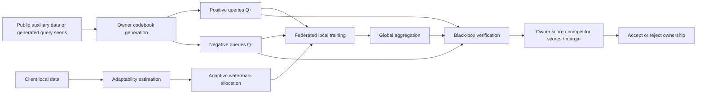

# BBV: Non-IID-Aware Low-Ambiguity Adaptive Black-Box Verification

[English](README.md) | [简体中文](README.zh-CN.md)

本仓库实现一个面向联邦学习模型版权保护的研究型代码框架，目标问题来自 `deep-research-report-2.md`：在非 IID 联邦训练场景下，设计一种同时兼顾 `non-IID adaptability`、`low ambiguity`、`black-box verifiability` 与 `lightweight provenance` 的版权验证方法。

项目当前聚焦如下研究主线：

- 面向非 IID 联邦训练的自适应 watermark 分配
- 基于多比特码本的黑盒版权验证
- 结合正证据与负证据的低歧义归属判决
- 面向 false-claim 风险的 margin 式竞争 owner 比较
- 支持真实攻击、统计校准、隐私泄漏评估与报告导出

## 目录

- [1. Research Overview](#1-research-overview)
- [2. Method Sketch](#2-method-sketch)
- [3. Repository Scope](#3-repository-scope)
- [4. Project Structure](#4-project-structure)
- [5. Environment Setup](#5-environment-setup)
- [6. Data Preparation](#6-data-preparation)
- [7. Quick Start](#7-quick-start)
- [8. Full Experiment Workflow](#8-full-experiment-workflow)
- [9. Output Artifacts](#9-output-artifacts)
- [10. Metrics and Research Questions](#10-metrics-and-research-questions)
- [11. Testing](#11-testing)
- [12. Practical Notes](#12-practical-notes)

## 1. Research Overview

### 1.1 Problem Setting

本项目针对如下研究问题：

> 在联邦学习中，如何构建一种既能适应 non-IID 数据异质性、又能降低误报与归属歧义，并且能够在黑盒查询条件下完成远程版权验证的方法？

与传统只关注单一 trigger 命中率的 black-box watermark 不同，这里强调的是：

- 不只是"能不能验证成功"，而是"能不能低歧义地验证成功"
- 不只是"对 owner 模型有效"，而是"对非 owner 模型不应误判"
- 不只是"攻击后还能触发"，而是"攻击后仍能维持可统计解释的 owner score / margin / AUC"

### 1.2 Research Goals

本仓库围绕 `deep-research-report-2.md` 中提出的五个研究目标展开：

- `H1`: 自适应 watermark 分配优于均匀分配
- `H2`: 多比特码本 + 负证据 + margin 判决降低 FPR 与 ambiguity
- `H3`: 在 hard-label 或低维输出 API 下仍可稳定完成黑盒验证
- `H4`: 在 fine-tuning、pruning、quantization、distillation、extraction 后仍保持鲁棒性
- `H5`: 在控制系统开销的同时，不显著增加隐私泄漏风险

### 1.3 Recommended Research Route

根据研究计划，首轮实验最适合的路线是：

- 视觉主集：`CIFAR-10`, `CIFAR-100`, `FEMNIST`
- 文本补充：`Sent140`
- 优先完成：主实验、消融、false-claim、robustness、privacy evaluation
- 暂不追求：重密码学协议、区块链存证、扩散模型、多模态 FL

## 2. Method Sketch

本仓库对应的方法原型可以概括为 `NILA-BBV`：

`Non-IID Low-Ambiguity Adaptive Black-Box Verification`

### 2.1 Core Modules

方法由五个核心模块组成。

1. `Codebook-Based Queries`
   为 owner 生成多比特码本，并据此构造 black-box 查询集合，而不是只依赖单个 trigger。

2. `Negative Evidence`
   除正证据查询外，再构造负证据集，用于抑制误触发与 false claim。

3. `Adaptive Allocation`
   根据客户端统计特征与 watermark 适配度，对 watermark 预算进行自适应分配，而不是均匀分配。

4. `Margin-Based Black-Box Decision`
   验证时不仅计算 owner score，还比较竞争 owner 的分数，并报告 margin 与 ambiguity。

5. `Lightweight Commitment`
   保存 owner 标识、seed、码本哈希、时间戳、训练配置摘要，作为轻量 provenance 记录。

### 2.2 Pipeline Overview



## 3. Repository Scope

### 3.1 What Is Implemented

当前仓库已经覆盖以下实验能力：

- 数据集加载
  - `cifar10`
  - `cifar100`
  - `femnist`（真实 LEAF 风格 natural split）
  - `sent140`（真实 LEAF 风格 natural split）
  - `shakespeare` 配置入口已保留，但当前重点实验建议使用 `sent140`

- 联邦训练
  - dataset-backed client subsets
  - controlled non-IID partitions: `dirichlet`, `shard`, `quantity_skew`, `combined_label_quantity`
  - natural partitions for LEAF-style datasets

- watermark / verification
  - 多比特码本
  - 正证据 / 负证据查询
  - owner score
  - competitor scores
  - margin decision
  - ambiguity flag
  - threshold calibration

- attacks
  - `finetune`
  - `pruning`
  - `quantization`
  - `distillation`
  - `extraction`

- evaluation / reporting
  - false-claim acceptance rate
  - ambiguity/FPR/FNR 汇总
  - privacy leakage AUC
  - robustness 汇总
  - 表格、图、summary markdown 导出

### 3.2 What Is Not the Focus

本仓库当前不以如下方向为首要目标：

- 重密码学举证协议
- 区块链或去中心化存证系统
- 扩散模型与多模态联邦版权保护
- 大规模生产系统部署

如果你的目标是第一篇论文复现与扩展，建议先在当前研究范围内完成实验闭环。

## 4. Project Structure

```text
bbv/
├── configs/                 # Hydra configs for train/eval/attacks/report
├── data/
│   ├── raw/                 # Raw or processed datasets
│   ├── splits/              # Saved partition metadata
│   └── cache/               # Temporary caches
├── docs/
│   └── superpowers/         # Plans and design docs
├── outputs/
│   ├── runs/                # Training runs
│   ├── attacks/             # Attack runs
│   ├── figures/             # Exported figures
│   ├── tables/              # Exported CSV tables
│   └── summaries/           # Markdown summaries
├── scripts/
│   ├── data/                # Dataset preparation scripts
│   ├── train/               # Training entrypoints
│   ├── eval/                # Verification entrypoints
│   ├── attacks/             # Attack entrypoints
│   └── report/              # Report export entrypoints
├── src/bbv/
│   ├── allocation/
│   ├── attacks/
│   ├── datasets/
│   ├── evaluation/
│   ├── federated/
│   ├── models/
│   ├── privacy/
│   ├── reporting/
│   ├── verification/
│   └── watermarking/
└── tests/
    ├── unit/
    ├── integration/
    └── smoke/
```

## 5. Environment Setup

### 5.1 Python Version

建议使用：

- `Python 3.11`

### 5.2 Create a Conda Environment

下面用 `conda` 举例。

```bash
conda create -n bbv python=3.11 -y
conda activate bbv
```

### 5.3 Install Dependencies

本仓库使用 `uv` 管理项目依赖。进入仓库根目录后执行：

```bash
uv sync --extra dev
```

`pyproject.toml` 里现在**不再固定安装 PyTorch**。这是为了让你根据机器环境单独选择正确的运行时版本。

如果你要使用 CUDA 12.8，请单独安装官方 `cu128` wheel：

```bash
uv pip install --index-url https://download.pytorch.org/whl/cu128 torch torchvision
```

如果你只想在 CPU 环境运行：

```bash
uv pip install --index-url https://download.pytorch.org/whl/cpu torch torchvision
```

如果你的机器还没有 `uv`，可以先安装：

```bash
pip install uv
```

### 5.4 Optional GPU Check

如果你希望确认 PyTorch 已正确识别 CUDA：

```bash
python -c "import torch; print(torch.cuda.is_available())"
```

如果 `import torch` 时出现 `libcudnn.so` 缺失或其他 CUDA 运行时错误，通常说明你安装的 PyTorch wheel 与服务器上的驱动/运行时环境不匹配，需要先重新安装正确的 wheel 版本。

## 6. Data Preparation

### 6.1 CIFAR Datasets

`CIFAR-10` 和 `CIFAR-100` 可以在训练时自动下载。

默认下载目录：

- `data/raw/`

### 6.2 Prepare LEAF Datasets

为了进行真实 natural non-IID 实验，先准备 LEAF 风格数据。

#### Prepare FEMNIST

```bash
uv run python scripts/data/prepare_leaf_datasets.py --dataset=femnist
```

#### Prepare Sent140

```bash
uv run python scripts/data/prepare_leaf_datasets.py --dataset=sent140
```

#### Prepare Both

```bash
uv run python scripts/data/prepare_leaf_datasets.py --dataset=all
```

默认输出布局：

```text
data/raw/femnist/train/*.json
data/raw/femnist/test/*.json
data/raw/sent140/train/*.json
data/raw/sent140/test/*.json
```

### 6.3 Dataset Notes

- `FEMNIST`
  - 真实 writer-level natural split
  - 适合验证 natural non-IID 图像联邦训练

- `Sent140`
  - 真实 user-level natural split
  - 适合补充文本任务结果

- `CIFAR-10 / CIFAR-100`
  - 适合做可控非 IID 分区，例如 Dirichlet、shard、quantity skew

## 7. Quick Start

这一节用于先确认代码、数据、命令链路都正常。

### 7.1 Run Smoke Tests

```bash
uv run pytest tests/smoke -q
```

### 7.2 Run Full Test Suite

```bash
uv run pytest tests/unit tests/integration tests/smoke -q
```

### 7.3 Train One Watermarked Model

以 `CIFAR-10` 为例：

```bash
uv run python scripts/train/run_watermark_baseline.py \
  dataset=cifar10 \
  allocation=adaptive \
  owner.id=owner0 \
  seed=0
```

以 `FEMNIST` 为例：

```bash
uv run python scripts/train/run_watermark_baseline.py \
  dataset=femnist \
  allocation=adaptive \
  owner.id=owner0 \
  seed=0
```

以 `Sent140` 为例：

```bash
uv run python scripts/train/run_watermark_baseline.py \
  dataset=sent140 \
  allocation=adaptive \
  owner.id=owner0 \
  seed=0
```

### 7.4 Run Verification

```bash
uv run python scripts/eval/run_verification.py \
  dataset=cifar10 \
  verification=margin \
  owner.id=owner0 \
  seed=0
```

### 7.5 Run One Attack

```bash
uv run python scripts/attacks/run_attack_suite.py \
  attack=finetune \
  dataset=cifar10 \
  seed=0
```

你也可以把 `attack` 改为：

- `pruning`
- `quantization`
- `distillation`
- `extraction`

### 7.6 Export One Report Bundle

```bash
uv run python scripts/report/build_report.py \
  dataset=cifar10 \
  study=main \
  outputs_dir=outputs/runs \
  attacks_dir=outputs/attacks
```

## 8. Full Experiment Workflow

这一节给出更接近论文复现的完整实验流程。

### 8.1 Recommended Execution Order

建议按如下顺序进行：

1. 环境与测试验证
2. 数据准备
3. 主训练实验
4. 黑盒验证
5. 攻击鲁棒性实验
6. false-claim 与消融实验
7. 汇总表图导出

### 8.2 Main 3-Seed Runs

研究计划建议至少运行 3 个随机种子。当前默认主矩阵配置：

- `seeds: [0, 1, 2]`
- report studies: `main`, `ablation`, `false_claim`, `robustness`

你可以手动依次运行：

```bash
uv run python scripts/train/run_watermark_baseline.py dataset=cifar10 allocation=adaptive owner.id=owner0 seed=0
uv run python scripts/train/run_watermark_baseline.py dataset=cifar10 allocation=adaptive owner.id=owner0 seed=1
uv run python scripts/train/run_watermark_baseline.py dataset=cifar10 allocation=adaptive owner.id=owner0 seed=2
```

如果你研究 `FEMNIST`：

```bash
uv run python scripts/train/run_watermark_baseline.py dataset=femnist allocation=adaptive owner.id=owner0 seed=0
uv run python scripts/train/run_watermark_baseline.py dataset=femnist allocation=adaptive owner.id=owner0 seed=1
uv run python scripts/train/run_watermark_baseline.py dataset=femnist allocation=adaptive owner.id=owner0 seed=2
```

如果你研究 `Sent140`：

```bash
uv run python scripts/train/run_watermark_baseline.py dataset=sent140 allocation=adaptive owner.id=owner0 seed=0
uv run python scripts/train/run_watermark_baseline.py dataset=sent140 allocation=adaptive owner.id=owner0 seed=1
uv run python scripts/train/run_watermark_baseline.py dataset=sent140 allocation=adaptive owner.id=owner0 seed=2
```

### 8.3 Non-IID Partition Studies on CIFAR

对于 `CIFAR-10 / CIFAR-100`，你可以调整配置中的分区参数，例如：

- `partition_type=dirichlet`
- `partition_type=shard`
- `partition_type=quantity_skew`
- `partition_type=combined_label_quantity`

示例：

```bash
uv run python scripts/train/run_watermark_baseline.py \
  dataset=cifar10 \
  dataset.partition_type=dirichlet \
  dataset.concentration=0.3 \
  allocation=adaptive \
  owner.id=owner0 \
  seed=0
```

数量偏斜示例：

```bash
uv run python scripts/train/run_watermark_baseline.py \
  dataset=cifar10 \
  dataset.partition_type=quantity_skew \
  dataset.quantity_sigma=1.0 \
  allocation=adaptive \
  owner.id=owner0 \
  seed=0
```

联合偏斜示例：

```bash
uv run python scripts/train/run_watermark_baseline.py \
  dataset=cifar100 \
  dataset.partition_type=combined_label_quantity \
  dataset.concentration=0.3 \
  dataset.quantity_sigma=1.0 \
  allocation=adaptive \
  owner.id=owner0 \
  seed=0
```

### 8.4 Verification Studies

验证阶段建议至少关注以下变量：

- `decision_threshold`
- `margin`
- `competitor_owner_ids`
- `hard_label_only`
- `query_budget`

hard-label-only 验证示例：

```bash
uv run python scripts/eval/run_verification.py \
  dataset=cifar10 \
  owner.id=owner0 \
  verification=margin \
  verification.hard_label_only=true \
  verification.query_budget=32 \
  seed=0
```

带竞争 owner 的示例：

```bash
uv run python scripts/eval/run_verification.py \
  dataset=cifar10 \
  owner.id=owner0 \
  verification=margin \
  verification.competitor_owner_ids=[owner1,owner2] \
  seed=0
```

### 8.5 Robustness Studies

分别运行 5 类攻击：

```bash
uv run python scripts/attacks/run_attack_suite.py attack=finetune dataset=cifar10 seed=0
uv run python scripts/attacks/run_attack_suite.py attack=pruning dataset=cifar10 seed=0
uv run python scripts/attacks/run_attack_suite.py attack=quantization dataset=cifar10 seed=0
uv run python scripts/attacks/run_attack_suite.py attack=distillation dataset=cifar10 seed=0
uv run python scripts/attacks/run_attack_suite.py attack=extraction dataset=cifar10 seed=0
```

完成后，再导出 robustness 报告：

```bash
uv run python scripts/report/build_report.py \
  dataset=cifar10 \
  study=robustness \
  outputs_dir=outputs/runs \
  attacks_dir=outputs/attacks
```

### 8.6 False-Claim and Ablation Studies

研究计划特别强调 false-claim 风险，因此建议保留：

- owner claim
- false claim
- 竞争 owner 分数对比
- ambiguity / margin 分布

建议导出以下 study：

```bash
uv run python scripts/report/build_report.py dataset=cifar10 study=main outputs_dir=outputs/runs attacks_dir=outputs/attacks
uv run python scripts/report/build_report.py dataset=cifar10 study=ablation outputs_dir=outputs/runs attacks_dir=outputs/attacks
uv run python scripts/report/build_report.py dataset=cifar10 study=false_claim outputs_dir=outputs/runs attacks_dir=outputs/attacks
uv run python scripts/report/build_report.py dataset=cifar10 study=robustness outputs_dir=outputs/runs attacks_dir=outputs/attacks
```

### 8.7 Recommended Minimal Paper-Grade Matrix

如果你的目标是先完成一版可投稿的实验矩阵，建议最少包含：

- 主数据集：`CIFAR-10`, `FEMNIST`
- 扩展数据集：`CIFAR-100` 或 `Sent140`
- 每组至少 `3 seeds`
- 主实验 + false-claim + robustness + privacy

一个现实可执行的最小矩阵是：

- `CIFAR-10`: main + robustness + ablation
- `FEMNIST`: main + robustness
- `Sent140`: main

## 9. Output Artifacts

### 9.1 Training Runs

训练输出位于：

- `outputs/runs/<run-id>/`

典型文件包括：

- `metrics.json`
- `run_metadata.json`
- `checkpoint.pt`
- `best_checkpoint.pt`
- `owner_artifacts.json`
- `owner_commitment.json`
- `allocation_assignments.json`
- `verification_summary.json`
- `verification_margin_summary.json`
- `calibration_artifacts.json`

### 9.2 Attack Runs

攻击输出位于：

- `outputs/attacks/<attack-run-id>/`

典型文件包括：

- `attacked_checkpoint.pt`
- `attack_log.json`
- `verification_after_attack.json`

### 9.3 Report Bundle

导出报告后会生成：

- `outputs/tables/`
- `outputs/figures/`
- `outputs/summaries/`

常见文件：

- `*-main-results.csv`
- `*-ablation-results.csv`
- `*-robustness-results.csv`
- `attack-robustness.csv`
- `*-main-figure.svg`
- `*-tradeoff-figure.svg`
- `owner-nonowner-score-distribution.svg`
- `*-summary.md`

## 10. Metrics and Research Questions

本项目建议至少关注以下指标。

### 10.1 Verification Metrics

- `owner_score`
- `competitor_scores`
- `margin_value`
- `decision`
- `ambiguity_flag`
- `threshold`
- `AUC`

### 10.2 Statistical Metrics

- `acceptance_rate`
- `ambiguity_rate`
- `FPR`
- `FNR`
- `false_claim_acceptance_rate`
- `robustness_acceptance_rate`
- 95% confidence interval

### 10.3 Privacy Metric

- `privacy_leakage_auc`

### 10.4 How They Map to H1-H5

- `H1`
  - 看 adaptive allocation 是否提升 acceptance rate 或降低 FNR

- `H2`
  - 看 ambiguity rate、FPR、false_claim_acceptance_rate

- `H3`
  - 看 hard-label-only 条件下的 acceptance stability

- `H4`
  - 看 robustness_acceptance_rate 与攻击后 owner score

- `H5`
  - 看 privacy_leakage_auc 与训练成本/实验开销

## 11. Testing

### 11.1 Smoke Tests

```bash
uv run pytest tests/smoke -q
```

### 11.2 Unit Tests

```bash
uv run pytest tests/unit -q
```

### 11.3 Integration Tests

```bash
uv run pytest tests/integration -q
```

### 11.4 Full Suite

```bash
uv run pytest tests/unit tests/integration tests/smoke -q
```

## 12. Practical Notes

### 12.1 Current Hardware Assumption

根据研究计划，首轮实验默认硬件预算约为：

- `1-2` 张 `24GB` 级消费级 GPU

如果你只有 CPU，也可以先完成 smoke test、unit/integration test 和小规模功能验证，但正式主实验会明显更慢。

### 12.2 Reproducibility Suggestions

建议在正式实验中固定：

- `seed`
- `dataset.partition_type`
- `dataset.concentration`
- `dataset.quantity_sigma`
- `owner.id`
- `verification.margin`
- `verification.decision_threshold`

同时保留：

- `run_metadata.json`
- `owner_commitment.json`
- `attack_log.json`
- `calibration_artifacts.json`

### 12.3 Common Issues

#### LEAF dataset not found

如果报错提示找不到 `data/raw/femnist/...` 或 `data/raw/sent140/...`，先运行：

```bash
uv run python scripts/data/prepare_leaf_datasets.py --dataset=all
```

#### No verification summary generated

先确认训练 run 目录下存在：

- `owner_artifacts.json`
- `best_checkpoint.pt` 或 `checkpoint.pt`

再运行验证命令。

#### Attack run exists but no post-attack verification

请确认攻击命令运行后，后续验证流程也被触发，或者重新运行报告导出前先检查：

- `outputs/attacks/<attack-run-id>/verification_after_attack.json`

### 12.4 Suggested First Reproduction Path

如果你第一次使用本仓库，建议按下面顺序操作：

1. `conda create -n bbv python=3.11 -y`
2. `conda activate bbv`
3. `pip install uv`
4. `uv sync --extra dev`
5. `uv run pytest tests/unit tests/integration tests/smoke -q`
6. `uv run python scripts/data/prepare_leaf_datasets.py --dataset=femnist`
7. `uv run python scripts/train/run_watermark_baseline.py dataset=femnist allocation=adaptive owner.id=owner0 seed=0`
8. `uv run python scripts/eval/run_verification.py dataset=femnist verification=margin owner.id=owner0 seed=0`
9. `uv run python scripts/attacks/run_attack_suite.py attack=finetune dataset=femnist seed=0`
10. `uv run python scripts/report/build_report.py dataset=femnist study=main outputs_dir=outputs/runs attacks_dir=outputs/attacks`

完成这条链路后，再扩展到 `CIFAR-10 / CIFAR-100 / Sent140` 和多 seed 主实验矩阵。
