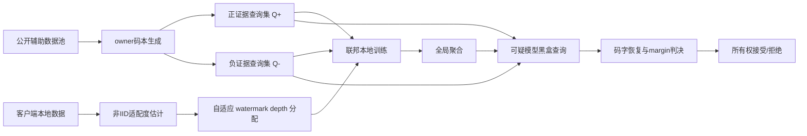
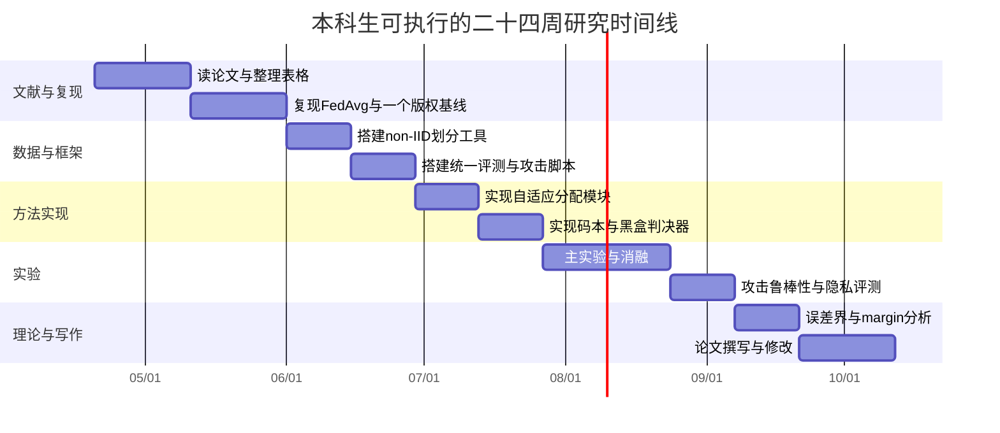

# 联邦学习中面向非IID低歧义自适应黑盒版权验证的研究计划

## 执行摘要

结合你上传的近两年论文与补充检索到的原始论文，可以把联邦学习版权保护这条线索概括为四步演进：早期工作先证明“联邦模型可以被加水印/指纹”，如 WAFFLE 与 FedIPR；随后工作开始处理“可追踪”和“多方所有权”，如 FedTracker；再往后，研究开始显式面对非IID和黑盒可验证性，如 FedAWM；而你上传的更近论文又把问题推进到“低歧义、可审计、密码学绑定、服务端主动防护”这些更接近真实争议解决的要求上，如 FedUIMF、Fed-PK-Judge、FedLock、TraCemop，以及 2026 年 FGCS 的 encoder-decoder 联邦水印方案。这个脉络非常适合凝练出一个新的本科生可做、又不至于太浅的选题：**非IID感知的低歧义自适应黑盒版权验证**。citeturn2search0turn2search1turn22view0turn26view0turn20view0turn21view0turn20view1turn25view0

我给你的**首选方向**不是“再做一个普通黑盒水印”，而是做一个**多比特码本式、可统计校准、非IID自适应分配、支持黑盒远程举证**的轻量框架。它的核心思想是：把 FedAWM 的“非IID适配”与 FedUIMF/Fed-PK-Judge 所强调的“低歧义、可证明、可审计”结合起来，但避免一上来就做区块链、扩散模型或复杂密码协议的重系统版本。这样既能形成明确 novelty，也能把计算量控制在本科生可承受的范围内。citeturn26view0turn20view0turn21view0turn20view1turn20view4

本报告默认以下前提：你的计算预算约为 **1–2 张 24GB 级消费级 GPU**；上传论文可以视为 2024–2026 年这一方向的代表性样本；你首篇论文目标是**期刊类而非顶会长文**；工作重点是**图像分类 + 一个轻量文本任务**，而不是直接冲扩散模型或多模态联邦学习。这个假设下，最现实的期刊路线是先做一篇“算法 + 完整实验 + 初步理论”的 KBS/FGCS 水平投稿，再根据理论成熟度决定是否上探更强的 entity["organization","IEEE","technical society"] 安全类期刊。citeturn9view0turn9view1turn9view2turn10search3

## 文献格局与空白

早期联邦版权保护工作主要回答“能不能嵌入版权证据”。WAFFLE 通过服务端聚合后再训练嵌入黑盒水印；FedIPR 进一步支持多客户端私有水印，并给出多方私有嵌入与检测的理论分析；FedTracker 则把“全局所有权验证”和“本地泄露追踪”拆成双层机制。与此同时，安全联邦学习场景下的 client-side backdooring 工作说明，在同态加密等安全设定下，水印不能再只靠服务端嵌入，必须改成客户端黑盒嵌入，而且还要显式考虑不可伪造性。citeturn2search0turn2search1turn22view0turn22view1

近两年文献的变化更关键。FedAWM 明确指出：在 non-IID 场景下，主任务梯度与水印任务梯度冲突会更严重，因此“均匀分配水印任务”不是好方案，应该根据客户端的 watermark adaptability 动态分配 watermark depth。FedUIMF 则正面瞄准“歧义攻击”，通过时间戳、数字签名和信息隐藏构成 triple-identity 机制，并用 DWT 与 JND 提高指纹不可感知性；Fed-PK-Judge 更进一步，把所有权验证从“保密触发集 + 阈值判决”推进到“非对称签名 + 确定性验证 + Kerckhoffs 原则”的密码学路线；FedLock 则不再满足于事后举证，而是利用 split federated learning 把完整模型参数隔离在服务端，配合黑盒水印做主动防盗。你上传的 FGCS 2026 方案与 2024–2025 的 FedCRMW、PersistVerify 一类工作，又说明当前研究非常关注“边界样本、压缩鲁棒、空间注意力、隐蔽性与恢复效率”的工程问题。citeturn26view0turn20view0turn21view0turn20view1turn25view0turn27search0turn27search1

真正推动你选题成立的，不是“又有了更多方法”，而是**新的攻击与审稿标准变了**。USENIX Security 2024 的 False Claims 工作表明，很多现有 model ownership resolution 方案只关注“被告如何逃避验证”，却没有认真考虑“原告如何伪造证据去诬陷独立模型”。这意味着，单纯提高触发集命中率已经不够，新的方案必须同时控制**误报、漏报和歧义**。NDSS 2025 的 Explanation as a Watermark 也指出，传统 backdoor watermark 存在 harmfulness 与 ambiguity 两个核心缺陷。中文综述文献对这一点有很清楚的术语化总结：伪造攻击就是歧义攻击，完整性对应低虚警率，可靠性对应低漏检率，效率与容量也应该成为系统评价维度。citeturn20view4turn7search4turn24view0

基于这条主线，我认为目前最值得做、但还没有被充分一体化解决的空白有四个。第一，**non-IID 适配与低歧义验证仍然是两条分开的研究线**：FedAWM 更重 task interference，FedUIMF/Fed-PK-Judge 更重 ambiguity 与 legal-grade attestation，但两者还没有真正合并。第二，**黑盒方案多数仍停留在 zero-bit/单一触发成功率视角**，缺少多比特、码本分离、显式 margin 的归属判别设计。第三，**统计校准不足**：很多论文报告 watermark accuracy，却很少给跨模型、跨所有者的 FPR/FNR 曲线和阈值选择原则。第四，**隐私泄漏与系统开销报告不完整**：当自适应分配本身需要利用客户端能力评分时，这些评分是否泄漏了标签分布或训练状态，往往没有被认真测量。citeturn26view0turn20view0turn21view0turn20view4turn24view0

### 候选方向对比

| 候选方向 | 代表工作 | 你能做出的新意 | 本科可行性 | 作为首投的建议 |
|---|---|---|---|---|
| 非IID感知的低歧义自适应黑盒验证 | FedAWM、FedUIMF、Fed-PK-Judge citeturn26view0turn20view0turn21view0 | 把 non-IID 自适应分配、码本式黑盒验证、统计阈值和 anti-forgery 统一起来 | 高 | **最推荐** |
| 可追踪黑盒验证与泄露归因 | FedTracker、TraMark、TraCemop citeturn22view0turn22view2turn1search7 | 在全局所有权外再区分“谁泄露了模型” | 中 | 第二篇更合适 |
| 密码学绑定的黑盒举证 | Fed-PK-Judge、FedZKP 线索 citeturn21view0turn26view0 | 引入承诺、时间戳、签名，提高争议解决可信度 | 中 | 可做轻量版辅助模块 |
| 扩散模型或多模态联邦版权保护 | VQ-FedDiff、MFL-Owner、联邦扩散水印 citeturn19search0turn17search0turn19search3 | 前沿感强，但训练和评测成本显著上升 | 低 | 不建议作为首篇 |

## 选题建议与研究问题

我建议你的论文题目往这个方向收敛：

**Non-IID-Aware Low-Ambiguity Adaptive Black-Box Copyright Verification for Federated Learning**

中文可以写成：

**面向非IID联邦学习的低歧义自适应黑盒版权验证方法研究**

这个题目有三个优点。第一，它直接站在你上传论文的交叉点上，而不是偏离现有积累。第二，它的 novelty 清楚：不是单纯“提高水印精度”，而是同时优化**非IID适配、低歧义和黑盒举证**。第三，它的投稿叙事适合期刊：一方面有清晰问题定义，另一方面实验设计也足够系统。citeturn26view0turn20view0turn21view0turn20view4

### 研究目标与假设

| 研究目标 | 对应假设 |
|---|---|
| 设计一种适用于 non-IID 场景的自适应黑盒版权验证框架 | **H1**：基于客户端“水印适配度”的动态分配，比均匀分配能在相同精度下降预算下显著降低漏检率 |
| 降低误报与歧义归属 | **H2**：多比特码本 + 负证据校验 + margin 判决，比传统单触发 zero-bit 验证有更低 FPR 与 ambiguity |
| 保证黑盒可远程验证 | **H3**：在仅访问标签或低维置信度的条件下，仍可稳定完成归属判定 |
| 提升对常见删除攻击的鲁棒性 | **H4**：在 fine-tuning、pruning、quantization、distillation 后，所提方案的验证 AUC 和 codeword 恢复率优于主要黑盒基线 |
| 控制系统成本与隐私风险 | **H5**：通过只在部分高适配客户端上分配水印任务，可以把通信/计算开销限制在较低水平，同时不显著增加隐私泄露风险 |

### 优先研究问题

| 优先级 | 研究问题 |
|---|---|
| 高 | **RQ1**：如何定义并估计客户端对 watermark task 的适配度，使其既能反映 non-IID 难度，又不会泄漏过多本地分布信息？ |
| 高 | **RQ2**：如何让黑盒验证从“是否触发成功”升级为“是否与某个所有者码本唯一匹配”？ |
| 高 | **RQ3**：如何把误报率、漏报率和歧义概率纳入同一个统计检验框架？ |
| 中 | **RQ4**：在 hard-label API 下，多少查询次数才能达到稳定、可复现的验证结论？ |
| 中 | **RQ5**：面对模型提取和蒸馏，哪些 watermark bits 更容易迁移，哪些更容易丢失？ |

## 技术路线

### 总体思路

我建议把方法设计成一个**轻量混合框架**，暂时不做重密码学协议，而是做“**统计可校准的黑盒验证 + 轻量承诺机制**”。具体来说：先用一个公开辅助数据池生成多比特 watermark/fingerprint 查询集；再根据客户端的 label skew、feature skew、quantity skew 和梯度冲突程度，动态决定哪些客户端承担较强的 watermark 学习；最终在验证时，不只看 owner 查询集的命中率，还同时看**负证据集**与**最近竞争 owner 的相似分数**，要求通过率高、误触发低、owner margin 大，才判定归属成立。这个设计兼容 FedAWM 的 non-IID 自适应思想，也吸收了 FedUIMF 和 Fed-PK-Judge 对“低歧义”和“可审计”的要求。citeturn26view0turn20view0turn21view0

### 建议的方法原型

我建议你把方法命名为 **NILA-BBV**，即 **Non-IID Low-Ambiguity Adaptive Black-Box Verification**。方法包含五个模块：

第一，**码本式查询生成**。为每个 owner 生成一个长度为 \(m\) 的二进制或多符号码字 \(c_i\)，并从公开辅助数据池构造对应的查询集 \(Q_i^+\)。与传统单触发不同，这里每个 bit 由一个查询子集支持，最终验证得到的是一个预测码字 \(\hat c_i\)，而不是单个 trigger 是否生效。这样天然适合做 error-correction 和 margin 判别。这个思路能直接针对“歧义攻击”和“误报”问题。citeturn20view4turn24view0

第二，**反歧义负证据集**。对每个 owner 再构建 \(Q_i^-\)，其中包含“容易被其他 owner 误认”或“容易被迁移模型误触发”的难例。验证时不只要求 \(Q_i^+\) 通过率高，还要求 \(Q_i^-\) 通过率低。换句话说，你不是只要求“证据出现”，而是要求“反证据不出现”。这一步非常重要，因为 false-claim literature 的核心问题就在于：很多方法只关注正证据，而没有把“反证据”制度化。citeturn20view4

第三，**non-IID 适配度估计**。参考 FedAWM，你可以定义客户端 \(k\) 的适配度  
\[
a_k=\sigma\left(\alpha \cos(g_k^{main},g_k^{wm})+\beta\,cover_k-\gamma\,skew_k-\delta\,priv_k\right),
\]
其中 \(g_k^{main}\) 和 \(g_k^{wm}\) 分别是主任务与 watermark 任务梯度，\(cover_k\) 表示本地类别覆盖度，\(skew_k\) 表示数据偏斜强度，\(priv_k\) 表示为了防止泄漏而加入的惩罚项。再根据 \(a_k\) 分配 watermark depth \(d_k\) 与损失权重 \(\lambda_k\)。直觉上，适配度高的客户端承担更多版权信号，适配度低的客户端少做甚至不做 watermark 学习。这样既降低主任务损伤，也让黑盒证据更集中、更稳定。citeturn26view0

第四，**黑盒判决器**。定义  
\[
s_i(M)=1-\frac{1}{m}d_H(\hat c_i(M),c_i)-\lambda \cdot ASR_i^-,
\]
其中 \(d_H\) 是 Hamming 距离，\(ASR_i^-\) 是负证据集误触发率。最终接受 owner \(i\) 的条件设为  
\[
s_i(M)\ge \tau,\qquad s_i(M)-\max_{j\neq i}s_j(M)\ge \gamma.
\]
这就把“正确匹配”与“唯一匹配”同时编码进验证条件里。这样定义后，你就能很自然地报告 **ambiguity rate**：  
\[
Amb(M)=\Pr\Big[\exists j\neq i: s_j(M)\ge \tau\Big].
\]

第五，**轻量承诺机制**。不要一开始上区块链。对本科生首篇论文来说，只要把 owner seed、码本哈希、生成时间戳和实验配置做一次不可篡改记录即可。这个模块的意义不是求完整密码学系统，而是向审稿人表明：你意识到“训练后再伪造证据”是现实风险。该思路与 FedUIMF 的时间戳/签名意识和 Fed-PK-Judge 的确定性验证路线是同方向的，但实现难度低得多。citeturn20view0turn21view0

### 威胁模型

你的论文应至少覆盖三类攻击者。其一是**恶意客户端/恶意用户**，他们拿到全局模型后尝试 fine-tuning、pruning、quantization、distillation 或 model extraction，以逃避验证。其二是**恶意原告**，他们并未真正拥有源模型，却试图构造可迁移的伪造查询，向独立模型发起错误归属指控。其三是**好奇但不完全可信的协调方**，如果你在扩展实验里加入客户端适配度分数上传，该分数本身可能泄漏本地分布信息。前两类威胁分别对应当前文献中的 watermark removal/model stealing 和 false claims 问题；第三类更多是你方案引入自适应机制之后必须补上的系统性说明。citeturn20view4turn26view0turn20view1

### 指标设计

中文综述对模型水印常见评价维度总结得很完整：保真度、鲁棒性、不可伪造性、隐蔽性、完整性、可靠性、效率、容量与通用性。你的论文应在此基础上再新增一个核心指标：**歧义度**。citeturn24view0

| 指标 | 定义建议 | 报告方式 |
|---|---|---|
| Ambiguity | 独立模型或其他 owner 模型被错误归属到当前 owner 的概率 | 平均值 + 95% CI；同时报告最近竞争者 margin |
| FPR | 非 owner 模型被接受的概率 | 以独立训练模型、其他 owner 模型、攻击后模型分别计算 |
| FNR | 真正盗版/派生模型未被接受的概率 | 按攻击类型分别报告 |
| Robustness | 攻击前后 owner score、AUC、码字恢复率变化 | fine-tuning / pruning / quantization / distillation / extraction |
| Utility | 主任务 accuracy / macro-F1 / perplexity 等 | 与无版权方案及各基线比较 |
| Overhead | 训练时间、额外通信字节、GPU 小时、额外本地 epoch | 总量与相对增幅都报 |
| Privacy leakage | 成员推断 AUC、标签分布推断准确率、适配度泄漏风险 | 至少做一个 empirical attack |

### 系统流程图

下面这张 Mermaid 图建议直接放进论文的“方法总览”小节。

## 实验与理论计划

### 数据集与 non-IID 划分策略

你的首篇论文不建议直接上 full ImageNet 或扩散模型。最稳妥的组合是：**CIFAR-10、CIFAR-100、FEMNIST、Shakespeare** 作为主体，**Sent140** 作为文本补充，**ImageNet 官方数据的一个小子集**作为可选加分项。CIFAR-10/100 与 ImageNet 是经典视觉基准；LEAF 提供了 FEMNIST、Shakespeare、Sent140 这些天然联邦数据，其中 FEMNIST 按 writer 划分，Shakespeare 按角色划分，Sent140 按用户划分，非常适合直接做 natural non-IID。citeturn4search1turn4search12turn4search9turn4search10turn4search0turn4search3turn5search0turn5search7turn5search22

| 数据集 | 任务 | 为什么适合你 |
|---|---|---|
| CIFAR-10 | 图像分类 | 复现实验快，适合先打通全流程 |
| CIFAR-100 | 图像分类 | 类别更多，更容易观察 non-IID 下 watermark 冲突 |
| FEMNIST | 图像分类 | 天然联邦划分，writer-level natural non-IID |
| Shakespeare | 字符级语言建模 | 证明方法不局限于图像 |
| Sent140 | 情感分类 | 补一个真实用户级文本任务 |
| ImageNet 小子集 | 图像分类 | 作为强泛化补充，不作为首轮主战场 |

对于划分方式，建议同时覆盖**自然异质性**和**可控合成异质性**。2021–2022 年关于 non-IID benchmark 的工作已经指出，label skew、feature skew 和 quantity skew 应被区分开来，而不是只做一种 Dirichlet 划分。你可以把 LEAF 数据作为 natural split，把 CIFAR 类数据做如下合成 split：label skew 用 Dirichlet \(\alpha\in\{0.1,0.3,0.5,1.0\}\) 与 shard split 并行；feature skew 用客户端专属数据增强，如 brightness、blur、Gaussian noise、style transfer；quantity skew 用 log-normal 或 Zipf 采样控制每个客户端样本数；最后再做 combined skew，把 label skew 与 quantity skew 叠加。citeturn6search0turn6search8turn6search9turn6search12

| skew 类型 | 实现建议 | 参数建议 |
|---|---|---|
| Label skew | Dirichlet 按类分配；或每客户端仅保留 2–4 个主类 | \(\alpha=0.1,0.3,0.5,1.0\) |
| Feature skew | 每客户端固定一种风格增强或成像条件 | 亮度/模糊/噪声/颜色偏移/风格迁移 |
| Quantity skew | 客户端样本量服从长尾分布 | log-normal \(\sigma\in\{0.5,1.0\}\) |
| Natural skew | 直接使用 LEAF 原生分组 | FEMNIST/Shakespeare/Sent140 |
| Combined skew | label + quantity 或 label + feature | 做 2–3 档难度即可 |

### 基线、消融与超参数

基线不宜贪多，否则本科阶段很容易被复现实验拖垮。我的建议是“**三大主基线 + 两个近邻对照 + 一个无版权上界**”。主基线包括 WAFFLE、FedIPR、FedTracker；近邻对照包括 client-side backdooring 和 FedAWM；如果你要突出低歧义，可以额外把 FedUIMF 与 Fed-PK-Judge 放进“设计对照”而非完整复现对照，因为它们不完全是同一问题设定。citeturn2search0turn2search1turn22view0turn22view1turn26view0turn20view0turn21view0

| 类别 | 具体方法 | 作用 |
|---|---|---|
| 无保护基线 | FedAvg / FedProx | 给 utility 上界与版权缺失下界 |
| 黑盒经典基线 | WAFFLE | 早期 server-side 黑盒基线 |
| 多方所有权基线 | FedIPR | 多客户端私有验证对照 |
| 双层保护基线 | FedTracker | 所有权 + traceability 对照 |
| Secure FL 对照 | client-side backdooring | 体现客户端嵌入路线 |
| non-IID 对照 | FedAWM | 体现自适应分配路线 |
| 设计对照 | FedUIMF / Fed-PK-Judge | 体现 low-ambiguity / provable 路线 |

消融实验至少需要六组：是否使用自适应分配；是否使用多比特码本；是否加入负证据集；是否做 margin 判决；是否使用 sequential verification；是否加入承诺模块。额外再做一个 hard-label-only 与 confidence-assisted 的对比，会很加分，因为这说明你的方法考虑了不同 API 暴露级别。citeturn20view4turn26view0

超参数方面，我建议第一轮全部从“小而稳”出发：客户端数 \(K=50\) 或 \(100\)，参与率 0.1，每轮本地 epoch \(E=5\)，总轮数 CIFAR-10 用 200 左右、CIFAR-100 与文本任务可适当增加；码字长度 \(m\) 从 32、64、128 三档；watermark loss 权重从小值热启动，例如 \(0.05\) 或 \(0.1\) 起步；如果做 error-correction，可先用简单 BCH/Hamming，不必一上来设计复杂编码。FedAWM 的公开实现环境表明，这类实验在 RTX 4090 24GB 上是可以完成的，因此你的目标应该是：**先把 CIFAR-10、FEMNIST 跑扎实，再扩展到 CIFAR-100 和一个文本集**。citeturn26view0

### 评测协议与统计检验

你的评测协议一定要比常见 watermark paper 更“法庭化”。具体有四条。第一，阈值不能拍脑袋，必须在独立验证集上校准。第二，FPR 不能只在无水印模型上测，还要在“其他 owner 的模型”和“攻击后独立模型”上测。第三，必须报告 owner score 分布、非 owner score 分布和最近竞争者 margin 分布。第四，所有主要结果至少跑 3 个随机种子，优先争取 5 个。这里的统计检验我建议如下：对黑盒通过率做 exact binomial confidence interval；对 AUC 对比做 DeLong；对同一测试集上的 paired acceptance result 做 McNemar；对多 seed 的 utility/drop 做配对 t 检验或 Wilcoxon。因为这是你方案的一大卖点，所以“统计可校准”应该成为论文写作时反复强调的关键词。这个建议与 False Claims 文献提出的“不能只看是否能指控成功，还要看是否会误指控”高度一致。citeturn20view4

### 理论分析计划

理论部分不要贪大，建议只做三层，做到“短而硬”。

第一层，**检测误差界**。把每个 bit 的恢复视作 Bernoulli 事件。若 owner 模型在正证据位上的成功率为 \(p_1\)，非 owner 模型为 \(p_0\)，在阈值 \(\tau\) 下，利用 Hoeffding 或 Chernoff 不等式，可以得到  
\[
FPR \le \exp\left(-2m(\tau-p_0)^2\right), \qquad
FNR \le \exp\left(-2m(p_1-\tau)^2\right).
\]
这类结果简单、标准、容易写清楚，也足够支撑“查询越多、误差越小”的直觉。

第二层，**歧义界**。当有 \(K\) 个 owner 时，定义 owner \(i\) 与其他 owner 的最小 margin 为 \(\Delta_i\)。如果接受条件带有 \(s_i-\max_{j\neq i}s_j\ge \gamma\)，就能通过 union bound 给出  
\[
Amb \le \sum_{j\neq i}\exp\!\left(-2m(\Delta_{ij}-\gamma)^2\right),
\]
至少可以作为 theorem/proposition 的目标形式。这个式子不要求你把所有分布都证明得特别细，只要把 margin 与 code length 的关系明确写出来，理论部分就已有亮点。

第三层，**自适应分配优于均匀分配的局部最优性**。在一阶近似下，把 watermark 对主任务的干扰写成  
\[
I=\sum_k w_k \langle g_k^{main}, g_k^{wm}\rangle.
\]
在固定 watermark budget 的约束下，若把更多权重分配给梯度更对齐、覆盖更充分、偏斜更小的客户端，可以证明 surrogate objective \(I\) 更小或不更坏。这个结果即使只做 proposition，也足以把你的“非IID 自适应”从经验启发提升到“有理论动机”。citeturn26view0

## 时间线资源与投稿策略

### 适合本科生的时间线

如果你有 5–7 个月，可按下面的节奏推进。这个节奏是为“先打一篇期刊稿，再决定是否扩展”的节奏设计的，而不是为一篇顶会极限冲刺设计的。

### 关键里程碑与交付物

| 阶段 | 时间估计 | 交付物 |
|---|---|---|
| 文献整合 | 2–3 周 | 一份 3–5 页 related work 综述 + 方法对比表 |
| 初始复现 | 3 周 | FedAvg + 1 个版权基线的可运行代码 |
| 数据工具 | 2 周 | label/feature/quantity skew 的统一划分脚本 |
| 方法原型 | 4 周 | NILA-BBV 的初版实现 |
| 主实验 | 4 周 | CIFAR-10/FEMNIST 主结果、消融、攻击结果 |
| 扩展实验 | 2 周 | CIFAR-100 或 Shakespeare/Sent140 结果 |
| 理论 | 2 周 | 2–3 个 theorem/proposition 草稿 |
| 写作 | 3 周 | 期刊格式初稿 + 附录与补充材料 |

### 所需资源

从工具与工程可行性看，你最适合用 **PyTorch + Flower/FedLab**。Flower 适合快速搭建联邦实验并支持异构模拟；FedLab 在数据划分与联邦数据处理上很方便；如果需要测 DP 或隐私预算，可以引入 Opacus。对于日志与复现实验，建议用 wandb 或 TensorBoard，但论文中只保留本地可重现实验脚本即可。citeturn12search0turn12search4turn12search7turn12search2turn12search14

硬件上，**1 张 RTX 4090/A6000 级 GPU 就足够完成第一篇论文**；如果有 2 张 GPU，你可以把多 seed 与多攻击实验并行。不要把第一篇的 compute 花在 full ImageNet 或联邦扩散模型上。VQ-FedDiff 和联邦扩散水印说明这个方向确实前沿，但训练成本与实验组织复杂度都明显更高，它们更适合你后续继续深挖时再进入。citeturn19search0turn19search3

### 风险与缓解

| 风险 | 表现 | 缓解方式 |
|---|---|---|
| 基线复现难 | 很多论文无完整代码或设定不统一 | 只精复现 3 个核心基线，其余做设计对照 |
| novelty 不够突出 | 审稿人觉得只是“FedAWM + 一点改进” | 明确把 low-ambiguity、FPR/FNR 校准、false-claim 评估做成主贡献 |
| 计算量失控 | 多数据集、多攻击、多 seed 导致排队太久 | 先固定 CIFAR-10 + FEMNIST 两主集；文本集作为补充 |
| 理论写不下来 | 一开始就想证明太强结果 | 先做检测误差界与 margin 界，再尝试自适应分配命题 |
| 隐私问题被 reviewer 追问 | 适配度需要上传统计量 | 增加 label-distribution inference attack，证明泄漏风险受控 |

### 预期贡献

如果按上面的计划执行，你的论文最有希望形成以下四点贡献。第一，提出一个**non-IID-aware 的低歧义黑盒版权验证框架**。第二，给出一个**统一的 ambiguity–FPR–FNR–utility 评测协议**。第三，证明一个**基于码长、margin 与阈值的误差上界**。第四，用完整实验说明：相比 uniform watermark assignment 与传统 zero-bit 黑盒方案，你的方法在复杂异质性下更稳、更难被误指控、也更接近期刊审稿人对“可信验证”的期待。citeturn26view0turn20view4turn24view0

### 目标期刊与会议备选

如果你希望“本科生首投尽量稳”，我建议优先考虑由 entity["organization","Elsevier","academic publisher"] 出版的算法/系统期刊，其次再考虑更强的 entity["organization","IEEE","technical society"] Transactions；若后续理论明显增强，再考虑 entity["organization","USENIX","systems association"] 或 entity["organization","ACM","computing society"] 安全会议作为备选路线。citeturn9view0turn9view1turn9view2turn10search3turn11search1turn11search2turn11search9

| 期刊或会议 | 适配度 | 你这篇工作的理想形态 | 版式与长度要点 |
|---|---|---|---|
| Knowledge-Based Systems | 很高 | 算法创新 + 系统实验 + 适度理论 | 原创论文“preferably no more than 20 double line spaced manuscript pages” citeturn9view0 |
| Future Generation Computer Systems | 很高 | FL 系统视角更强，强调开销与工程完整性 | Full Length Article 为双栏单倍行距，**18 页内** citeturn9view1 |
| IEEE Internet of Things Journal | 中高 | 要有 edge/IoT/device 场景叙事 | IEEE 双栏模板；摘要 150–250 词；发表后 **超 8 页**有强制版面费 citeturn9view2 |
| IEEE Transactions on Dependable and Secure Computing | 中 | 必须把 false claims、deterministic evidence、理论性再做强 | 依 IEEE CS MOPC，regular paper 长度线通常按 **12 formatted pages** 计，提交上限 **18 页** citeturn10search3 |
| NDSS / USENIX Security / ACM CCS | 备选 | 如果你把 low-ambiguity 与 false-claim 理论做得很强，可转安全会议路线 | NDSS 主体 13 页内；USENIX Security 主体 13 页、终稿 20 页内；CCS 双栏 12 页技术正文 citeturn11search9turn11search1turn11search7turn11search2 |

对你个人而言，我的现实排序是：

**首选：KBS 或 FGCS**  
**冲刺：IoTJ**  
**大幅增强理论后再考虑：TDSC**

### 建议放进论文的图表

| 图表 | 内容 | 作用 |
|---|---|---|
| Fig.1 | 方法总览图 | 一眼说明“自适应分配 + 码本验证 + margin 判决” |
| Fig.2 | owner / non-owner / false-claim score 分布图 | 直接体现低歧义 |
| Fig.3 | utility–ambiguity tradeoff 曲线 | 说明不是靠牺牲主任务换来的 |
| Fig.4 | 不同 non-IID 强度下的 FPR/FNR/AUC 曲线 | 体现方法在异质性下仍稳定 |
| Table.1 | 相关方法对比表 | 定位论文 |
| Table.2 | 数据集与划分表 | 体现实验充分性 |
| Table.3 | 主结果表 | 汇总核心指标 |
| Table.4 | 消融表 | 证明每个模块必要 |
| Table.5 | 攻击鲁棒性表 | 回答 reviewer 的安全性质疑 |

综合来看，这个方向最适合你的切入点不是“做最复杂的系统”，而是**把问题定义做准，把评测协议做严，把 low-ambiguity 做实，把 non-IID 适配做出明显收益**。如果你把题目收敛到“自适应分配 + 码本黑盒验证 + 统计阈值 + false-claim 评测”，这会是一篇非常像样、也足够适合本科生首投期刊的选题。你上传的论文已经给了你非常好的起点：FedAWM 告诉你怎么处理 non-IID；FedUIMF 和 Fed-PK-Judge 告诉你为什么“低歧义”值得单独做成贡献；FedLock、FedTracker、TraMark 则说明一旦首篇工作做扎实，后面还可以自然延伸到主动防盗、追踪与多客户端归因。citeturn26view0turn20view0turn21view0turn20view1turn22view0turn22view2